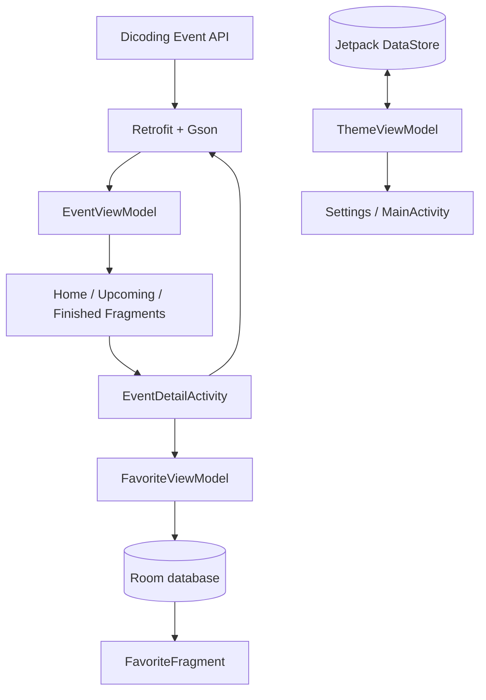
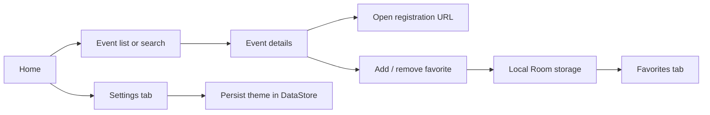

# MyDicodingEvent

**An Android event discovery app built with Kotlin, MVVM, Retrofit, Room, and Jetpack DataStore.**

MyDicodingEvent is a native Android application developed as a submission project for **Dicoding's Belajar Fundamental Aplikasi Android** course. It brings Dicoding community events into a simple mobile experience: discover upcoming and finished events, search by name, inspect details, save favorites locally, and choose a light or dark theme.

This repository is a **learning project and Android portfolio piece**, not an official Dicoding application.

**Highlights:** Kotlin · Android Views / XML · MVVM · Retrofit · LiveData · Room · DataStore · Glide

## What the app does

| Screen | Functionality |
| --- | --- |
| **Home** | Displays upcoming and finished event lists and filters both lists by event name as you type |
| **Upcoming** | Shows up to five events whose start time is in the future |
| **Finished** | Shows up to five events whose end time has passed |
| **Event details** | Shows event cover, description, date/time, organizer, and remaining quota; opens the event's registration link in a browser |
| **Favorites** | Saves and removes selected events using a local Room database |
| **Settings** | Toggles light/dark mode and persists the preference with Jetpack DataStore |

The app retrieves event data from the public **Dicoding Event API**. The API response is parsed into Kotlin models and filtered by event dates on the client. In the event details screen, an event is looked up from the API list by its ID.

**Search scope:** The search field is on the Home screen and filters the loaded event names. It is not a server-side or full-text search.

## Architecture

The application follows **Model–View–ViewModel (MVVM)** for event data, favorites, and theme preferences. Android `Activity` and `Fragment` classes handle UI rendering and user interactions, while `ViewModel` exposes observable state through `LiveData`.



### Key technical decisions

- **Retrofit + Gson:** Fetch event records from `https://event-api.dicoding.dev/events`.
- **LiveData + ViewModel:** Keep event lists and loading states observable by the UI.
- **Room + DAO:** Persist favorites on-device and observe saved records.
- **DataStore Preferences:** Persist the user's theme selection between app launches.
- **Glide:** Load remote event cover images, including placeholder and error imagery in list items.
- **ViewBinding:** Access XML views without relying on repeated view lookup in most screens.
- **BottomNavigationView + Fragments:** Switch among Home, Upcoming, Finished, Favorite, and Settings. This implementation uses manual Fragment transactions rather than Jetpack Navigation.

The app separates remote event discovery from local persistence. **Favorites are stored offline**, but opening a favorite's detail page still triggers a network request in the current implementation.

## Tech stack

| Area | Implementation |
| --- | --- |
| Language | Kotlin 1.9.22 |
| Android UI | XML layouts, Material Components, RecyclerView, ViewBinding |
| Architecture | MVVM with AndroidX ViewModel and LiveData |
| Networking | Retrofit 2.9.0 and Gson converter |
| Image loading | Glide 4.16.0 |
| Local persistence | Room 2.6.1 |
| Preferences | AndroidX DataStore Preferences 1.1.1 |
| Build | Gradle Kotlin DSL, Android Gradle Plugin 8.7.3, Gradle wrapper 8.9 |
| Minimum Android version | Android 5.0 (API 21) |

The repository currently configures `compileSdk = 34` and `targetSdk = 35`. If Android Studio reports SDK or build-tool incompatibilities, inspect those settings and the dependencies before changing the project.

## User flow



The Home screen presents both categories in one place. Dedicated Upcoming and Finished tabs provide short, filtered lists. The Favorites tab is backed by a local database rather than the API.

## Project structure

```text
MyDicodingEvent/
├── app/
│   ├── build.gradle.kts
│   └── src/
│       ├── main/
│       │   ├── AndroidManifest.xml
│       │   ├── java/com/example/mydicodingevent/
│       │   │   ├── MainActivity.kt
│       │   │   ├── EventDetailActivity.kt
│       │   │   ├── model/          # Event API and Room data models
│       │   │   ├── network/        # Retrofit API definitions
│       │   │   ├── database/       # Room database and favorites DAO
│       │   │   ├── preferences/    # Theme persistence with DataStore
│       │   │   └── ui/
│       │   │       ├── adapter/    # RecyclerView adapters
│       │   │       └── viewmodel/  # Event, favorite, and theme state
│       │   └── res/               # Layouts, icons, themes, strings
│       ├── test/                   # Local JVM test sources
│       └── androidTest/            # Instrumentation test sources
├── gradle/
├── gradlew
├── gradlew.bat
└── README.md
```

Useful code entry points:

- [`EventViewModel.kt`](app/src/main/java/com/example/mydicodingevent/ui/viewmodel/EventViewModel.kt) — fetches, classifies, and exposes events.
- [`HomeFragment.kt`](app/src/main/java/com/example/mydicodingevent/ui/HomeFragment.kt) — event discovery and name filtering.
- [`EventDetailActivity.kt`](app/src/main/java/com/example/mydicodingevent/EventDetailActivity.kt) — event details, registration link, and favorite interactions.
- [`FavoriteEventDao.kt`](app/src/main/java/com/example/mydicodingevent/database/FavoriteEventDao.kt) — insert, delete, and observe favorites.
- [`ThemePreferences.kt`](app/src/main/java/com/example/mydicodingevent/preferences/ThemePreferences.kt) — persists dark mode.
- [`ApiService.kt`](app/src/main/java/com/example/mydicodingevent/network/ApiService.kt) — event API contract.

## Getting started

### Prerequisites

- Android Studio with a compatible Android SDK
- JDK 17 for the Android Gradle Plugin used by this repository
- An Android device or emulator running **API 21 or newer**
- Internet access for downloading dependencies and retrieving events

### Run in Android Studio

1. Clone the repository:

   ```bash
   git clone https://github.com/alfrzhb/MyDicodingEvent.git
   cd MyDicodingEvent
   ```

2. Open the **MyDicodingEvent** folder in Android Studio.
3. Let Gradle sync and install any Android SDK components requested by the IDE.
4. Select an emulator or connected device.
5. Run the **app** configuration.

No API key is required in the checked-in configuration. The app uses the Dicoding Event API base URL defined in [`ApiConfig.kt`](app/src/main/java/com/example/mydicodingevent/network/ApiConfig.kt).

### Gradle commands

On macOS or Linux:

```bash
./gradlew assembleDebug
./gradlew testDebugUnitTest
```

On Windows:

```powershell
.\gradlew.bat assembleDebug
.\gradlew.bat testDebugUnitTest
```

To run instrumentation tests, launch an emulator/device and use `connectedDebugAndroidTest`.

**Verification note:** These are standard project commands, not evidence of a successful build in this documentation update. The repository currently includes Android template/example tests; automated feature-level test coverage has not been established here.

## Current implementation boundaries

This project demonstrates common Android development patterns but still has areas suitable for improvement:

- **Event details:** The detail screen re-fetches the event list and searches for the selected ID rather than using a dedicated details endpoint.
- **Network handling:** Requests rely on the availability and response shape of the Dicoding Event API; comprehensive empty/error/retry states are not present across every screen.
- **List size:** Dedicated Upcoming and Finished screens intentionally show a maximum of five matching items each.
- **Favorites:** Saved records are persistent, but full event detail information is not independently available offline.
- **Navigation:** Uses manual Fragment replacement; it does not use Jetpack Navigation Component.
- **Tests and maintenance:** Feature tests, CI, dependency review, and a verified modern build are reasonable next steps.

This README intentionally uses **architecture and feature documentation instead of screenshots**; no emulator screenshots or rendered UI previews have been fabricated.

## Context and credits

Developed by [Muhammad Alfarizi Habibullah](https://github.com/alfrzhb) as part of the **Dicoding — Belajar Fundamental Aplikasi Android** learning program.

Event information is supplied by the [Dicoding Event API](https://event-api.dicoding.dev/). This repository is an independent educational implementation and is not an official Dicoding product.

## License

Licensed under the **Apache License 2.0**. See [LICENSE](LICENSE) for details.
